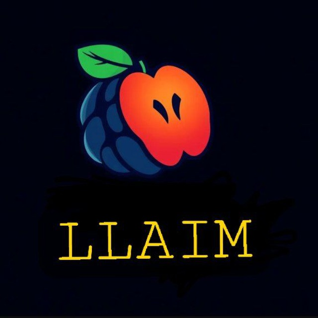
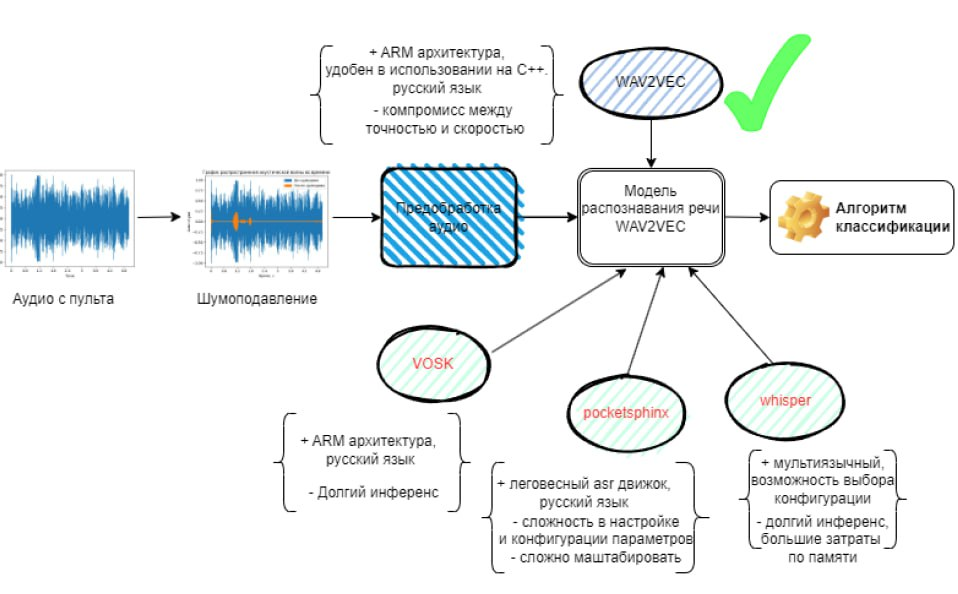

# Цифровой прорыв 2024 СЗФО
# Кейс от НИИАС РЖД: Интеллектуальный пульт
<a name="readme-top"></a>
<p align="center">  

</p>
  <p align="center">
    <!--<h1 align="center">LLAIM</h1>-->
  </p>
  <p align="center">
    <p></p>
    <!-- <p><strong>Интеллектуальный пульт составителя.</strong></p> -->

  </p>
</div>

**Содержание:**
- [Проблематика задачи](#title1)
- [Описание решения](#title2)
- [Обучение модели](#title3)
- [Оценка наших моделей](#title4)
- [Запуск решения](#title5)

### Разработан в рамках [ЦП](https://hacks-ai.ru/events/1077380) командой "LLAIM".

### Live версия доступна [тут](https://ee04b446f7e9c9a575.gradio.live)

## <h3 align="start"><a id="title1">Проблематика задачи 🧐</a></h3>  
1. Необходимость голосового управления 🗣️🔇
   
   1.1 шумная окружающая среда
   
   1.2 Высокий риск неверного распознавания команды 📜🥶
   
2. Упрощение управления объектом 🧑‍🔧🖲️
   
   2.1 трансляция речечых команд
   
3. Ограниченность вычислительных ресурсов 🔋🪫
   
    3.1 решение должно работать на микроконтроллере
    3.2 важная скорость end-to-end обработки 

----

## <h3 align="start"><a id="title2">Описание решения 📝</a></h3>



* Шумоподавление
* Оценка энергетической составлящей сисгнала
* ASR Wave2vec
* Классификациия распознанной команды
* Формирование выхода модели в соответсвии с требованиями заказчика
 
### Структура проекта 🧱

```
├── rzd_main # основной пакет проекта с моделью
│   ├── model.py # основной модуль, реальзующий логику решения
│   ├── constants.py # модуль, содержащий необходимые коснтанты
│   ├── rzd_functions.py # модуль, содержащие необходимые функции
├── rzd_utils # вспомогательный пакет проекта, предназначенный для создания аугментированных данных
│   ├── utils.py # функционал добавляющий доменный шум к аудио
├── images # директория с изображениями
├── get_submission.py # файл распознающий команды с помощью пакета rzd_main и записвающих их в правильный формат
├── Обучение_и_инференс_onnx.ipynb # обучение wav2vec модели и инференс onnx модели
├── notebook_app.ipynb # запуск gradio приложения
├── requirements.txt # файл с зависимостями проекта
├── weights.txt # ссылка на веса модели, которые надо распоковать в папку weights
├── onnx_weights.txt # аналогичный файл, но ссылка на квантизованные с помощью onnx веса 
├── README.md
```

## <h3 align="start"><a id="title3">Обучение модели 🧑‍🔬</a></h3> 

За основу была взята модель типа Wav2Vec, так как проведенный командой анализ показал,что данная модель подходит под задачу (распознавание речи) имеет ряд преимуществ перед своими конкурентами:
+ Легко конфигурируется под требуемую архитектуру процессора (ARM)
+ Имеет русский язык
+ Легко оборачивается в onnx (можно развернуть на C++) + быстрая квантизация в поддерживаемый формат процессора (INT8)

## Инструкция по установке

0. склонировать репозиторий

```
git clone https://github.com/Yagorka/LLAIM_rzd.git
```

и перейти в него
```
cd LLAIM_rzd
```

1. установить python версии `3.9.19`

2. устноавить зависимости проекта requirements путём запуска следующей команды

```
pip install -r requirements.txt
```

3. скачать веса по ссылкам, указаным в файлах `weights.txt` - для итоговой модели, `onnx_weights.txt` - для onnx модели с квантизацией (`скачивать архивом путм нажатия на название папки`)

```
weights.txt - это веса модели, которая работает точнее (f1=0.90, wer=0.35), но медленне (0.32)
onnx_weights.txt - это веса модели, которая работает точнее (f1=0.80, wer=0.40), но медленне (0.23)
запустить onnx модель возможно только в ноутбуке Обучение_и_инференс_onnx.ipynb. файл get_submission.py требует наличия весов weights.txt
```
5. скаченные веса распаковать в корневую директорию проекта
6. запустить файл `get_submission.py` с указанием аргументов (директории, где лежат аудиофайлы, и директории, где будет сохранён файл submission.json) путём запуска следующей команды

```
python -m get_submission --src input_dir --dst output_dir
```
